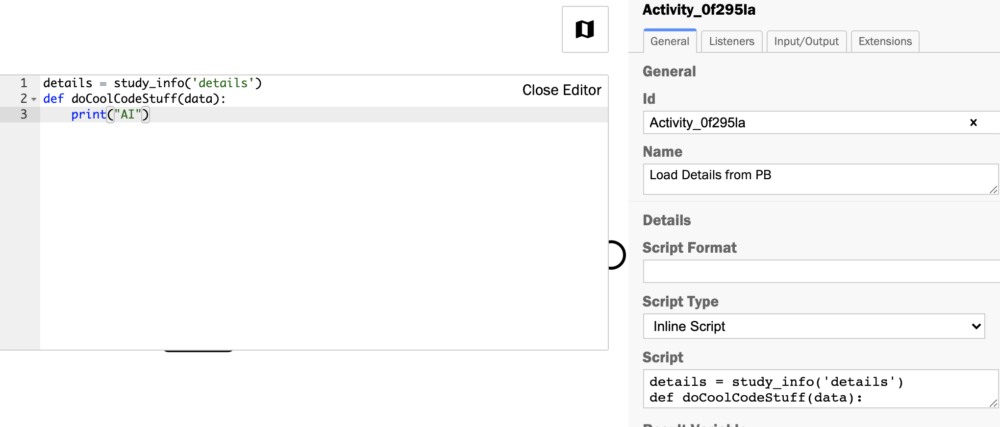

# diagram-js Code Editor

[]()

A code editor for diagram-js.




## Features

* [x] Modify script tasks with python formatting 
* [ ] Tests scripts in place with feedback
* [ ] View externally provided data and functions

## Usage

Extend your diagram-js application with the coding module. We'll use [bpmn-js](https://github.com/bpmn-io/bpmn-js) as an example:

```javascript
import BpmnModeler from 'bpmn-js/lib/Modeler';

import codingModule from 'diagram-js-code-editor';

var bpmnModeler = new BpmnModeler({
  additionalModules: [
    codingModule
  ]
});
```

For proper styling integrate the embedded style sheet:

```html
<link rel="stylesheet" href="diagram-js-minimap/assets/diagram-js-code-editor.css" />
```

Please see [this example]() for a more detailed instruction.


## License

MIT
